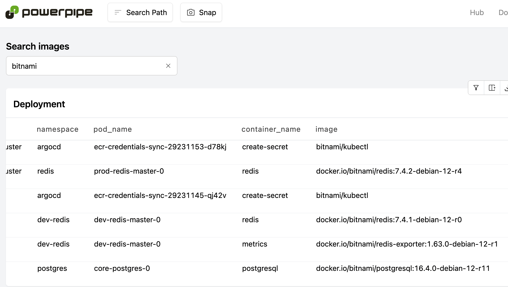

# Kubernetes Image Inventory - Powerpipe Mod

A Powerpipe mod for inventorying and analyzing container images across Kubernetes clusters.


Thanks to Bitnami, this project was required.




## 🚀 Features

- **Container Image Inventory**: Track container images, versions, and pull policies
- **Multi-cluster Support**: Query container images across multiple Kubernetes clusters simultaneously
- **Interactive Dashboards**: Visualize your container images and download them as CSV

## 🛠️ Installation

### 1. Install Powerpipe and Steampipe

Download and install [Powerpipe](https://powerpipe.io/downloads) and [Steampipe](https://steampipe.io/downloads).

```bash
# macOS
brew install turbot/tap/steampipe
brew install turbot/tap/powerpipe
```

### 2. Install Kubernetes Plugin

```bash
steampipe plugin install kubernetes
steampipe service start
# or steampipe service restart
```

### 3. Initialize Powerpipe Project

```bash
mkdir my-powerpipe-project
cd my-powerpipe-project

# Initialize a new Powerpipe mod
powerpipe mod init
```

### 4. Install `powerpipe-mod-kubernetes-image-inventory` mod

```bash
powerpipe mod install github.com/oguzhan-yilmaz/powerpipe-mod-kubernetes-image-inventory
```

### 5. Start Powerpipe Server

```bash
powerpipe server
```

Visit [http://localhost:9033](http://localhost:9033) to access your dashboards.

## ⚙️ Configuration

This plugin will use the Steampipe Connection named `kubernetes`:

- **single-cluster**: single connection with correct `config_context`
- **multi-cluster**: many connections and aggregator type connection named `kubernetes`


**Edit the Kubernetes configuration file:**

```bash
vim $HOME/.steampipe/config/kubernetes.spc
```


### Single Cluster Setup

For a single Kubernetes cluster, create single connection like: `connection "kubernetes" {...}`


1. **Add your cluster configuration:**

```hcl
# Production EKS Cluster
connection "kubernetes" {
  plugin         = "kubernetes"
  config_path    = "~/.kube/config"
  config_context = "default"  // Change to your context name
  source_types   = ["deployed"]
  custom_resource_tables = ["*"]
}
```

2. **Restart Steampipe service:**

```bash
steampipe service restart
```

### Multi-Cluster Setup

This mod supports querying multiple Kubernetes clusters simultaneously. Configure multiple connections and aggregate them:

1. **Add your cluster configurations:**

```hcl
# Production EKS Cluster
connection "kubernetes_eks_prod" {
  plugin         = "kubernetes"
  config_path    = "~/.kube/config"
  config_context = "eks-prod-cluster"  // Change to your context name
  source_types   = ["deployed"]
  custom_resource_tables = ["*"]
}

# Staging GKE Cluster
connection "kubernetes_gke_staging" {
  plugin         = "kubernetes"
  config_path    = "~/.kube/config"
  config_context = "gke-staging"       // Change to your context name
  source_types   = ["deployed"]
  custom_resource_tables = ["*"]
}


# Aggregator connection - combines all clusters
# MUST BE NAMED kubernetes
connection "kubernetes" {
  plugin      = "kubernetes"
  type        = "aggregator"
  connections = ["kubernetes_eks_prod", "kubernetes_gke_staging"]
}
```

2. **Restart Steampipe service:**

```bash
steampipe service restart
```


## 🎯 Use Cases

- **Image Inventory**: Track all container images deployed across your clusters
- **Security Auditing**: Identify outdated or vulnerable images
- **Cost Optimization**: Find duplicate or unused images
- **Compliance**: Ensure all images follow your organization's policies
- **Migration Planning**: Understand image usage patterns for cluster migrations

### Debug Commands

```bash
# Verify plugin and mod installation
steampipe plugin list
powerpipe mod list

# Check available contexts
kubectl config get-contexts

# Test your Kubernetes connections available to Stempipe
steampipe query "SELECT DISTINCT(context_name) FROM kubernetes.kubernetes_namespace"
```
